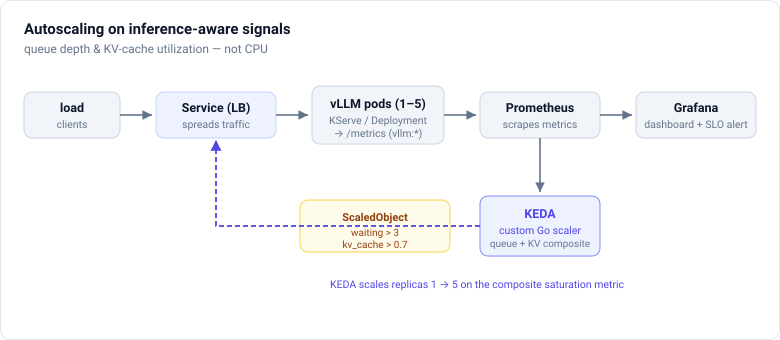
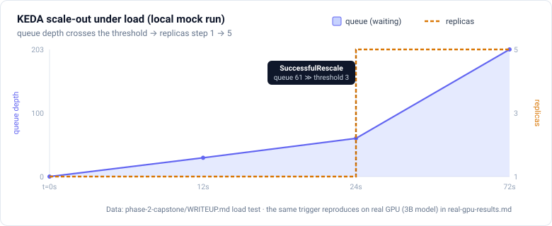

# Inference Platform

An autoscaling **LLM inference platform on Kubernetes** that scales vLLM on
inference-aware signals — request-queue depth and KV-cache utilization, not CPU —
through a custom KEDA external scaler, validated on a DIY two-GPU cluster with real
vLLM serving.

## Highlights

- **Autoscaling reacts to the right signal** *(local `kind` cluster, mock vLLM)*. Under
  load, KEDA scaled the serving Deployment **1 → 5 replicas** on queue depth; routing
  traffic through a load balancer is what actually put the new replicas to work. →
  [capstone write-up](phase-2-capstone/WRITEUP.md) ·
  [raw run](phase-2-capstone/local/runs/2026-08-27-scale-out/README.md)
- **Real two-GPU vLLM** *(DIY two-GPU cluster, real vLLM)*. Qwen2.5-1.5B sustains
  **~2,600 tok/s** (compute-bound); the 3B model's smaller KV pool trips the
  KV-cache/queue trigger — the regime flip that inference-aware scaling is built for. →
  [real-GPU results](phase-2-capstone/gpu-node/real-gpu-results.md)
- **A custom Go KEDA external scaler** on a composite queue-depth + KV-cache saturation
  metric, built and unit-tested in CI. → [the scaler](phase-2-capstone/keda-inference-scaler/README.md)

This began as self-directed, hands-on depth in LLM inference serving — the platform layer
that sits underneath generative AI models: GPU scheduling, high-throughput serving
engines, inference-aware autoscaling, and the observability and economics of running
models at scale. It's organized in two tracks: a literacy track (vocabulary and measured
local serving) and a build track (the autoscaling platform above).

## What is AI inference?

Inference is the serving phase of a model's lifecycle. You take an already-trained model and run it to produce outputs in response to live requests. It is the counterpart to training: training builds the model's weights, and inference uses those weights to generate tokens for users. Every time you send a prompt to a chatbot, a coding assistant, or any generative AI product, you trigger an inference request.

For a large language model, a single request runs in two distinct phases:

- **Prefill** is the first forward pass. It processes the entire input prompt and produces the first output token. It is compute-bound, so the work scales with prompt length and saturates GPU compute (FLOPs).
- **Decode** is the token-by-token generation that follows. It is memory-bandwidth-bound, so each new token depends on the growing KV cache rather than raw compute.

### Why it matters

- **It is where the cost lives.** A model is trained once but served billions of times. GPUs are the dominant cost, so the unit economic that matters is cost-per-million-tokens, driven by utilization, batching, and quantization.
- **It is where the user experience lives.** Latency signals like time-to-first-token (TTFT) and tokens-per-second directly shape how a product feels. The serving layer, not the model weights, decides whether responses feel instant or sluggish.
- **It scales differently from normal infrastructure.** CPU utilization is nearly meaningless for GPU inference. The real saturation signals are KV-cache pressure, queue depth, and tail latency, which is why inference needs autoscaling built around those signals instead of the CPU-based autoscaling most platforms use.

## What's here

| Section | What it covers |
| --- | --- |
| [Glossary](docs/glossary.md) | The inference-serving vocabulary: request lifecycle, batching, metrics, engines, autoscaling. |
| [Phase 1 — Foundations](phase-1-foundations/README.md) | Serving a model locally and measuring TTFT and throughput, with a written brief on how serving works and why it is hard. |
| [Phase 2 — Capstone](phase-2-capstone/README.md) | Building an autoscaling LLM inference platform on Kubernetes (KServe + vLLM + KEDA + Prometheus/Grafana). |
| [Resources](docs/resources.md) | Curated papers, books, blogs, podcasts, and videos on LLM inference serving. |

Start with the [Glossary](docs/glossary.md) for the vocabulary, then the [Phase 1 results](phase-1-foundations/results.md) for measured behavior on real hardware.
