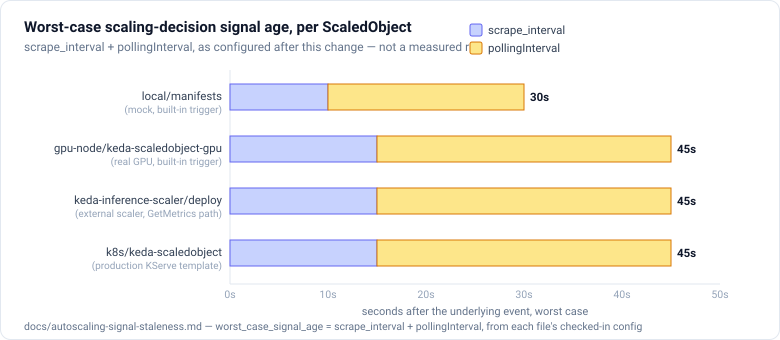

# Building an autoscaling LLM inference platform on Kubernetes

> **Status: the platform is built and the results below are final.** The control
> plane is validated end to end on a local cluster, and real-GPU serving numbers
> are captured on the DIY two-GPU cluster (Qwen2.5-1.5B and 3B on real vLLM), see
> [`gpu-node/real-gpu-results.md`](gpu-node/real-gpu-results.md). The two-GPU
> load-balanced scale-out run and the KServe comparison are done. The layers still
> pending live bring-up: the Envoy AI Gateway, and the pollingInterval-regime charts
> in [Signal staleness](#signal-staleness-in-the-autoscaling-control-loop) (the
> methodology and derivation are done; the captured regime runs are not).

## TL;DR

I built a Kubernetes platform that autoscales LLM inference on inference-aware
signals, request-queue depth and KV-cache utilization, instead of CPU. I
validated the whole control loop locally with **no GPU spend** using a metrics-
faithful mock of vLLM, then reproduced the same trigger on real GPUs. Under load,
KEDA scaled the serving deployment **1 → 5 replicas** on the queue-depth signal,
and a load-balanced in-cluster test showed the new replicas absorbing traffic
(concurrent in-flight requests rising to 5× the single-replica capacity). The
non-obvious lesson is that the autoscaler is only half the system. How traffic is
routed to the new replicas decides whether scaling actually helps.

## Why inference autoscaling is different

Classic web autoscaling watches CPU and request rate. Both are nearly useless
for LLM serving on a GPU:

- **GPU "utilization %" doesn't track saturation.** It measures the fraction of
  time a kernel was active; a single memory-bound decode can read ~100% while
  real compute headroom is large.
- **Memory-used is pre-allocated.** vLLM reserves most of VRAM for the KV-cache
  pool at startup, so memory-used is pegged regardless of load.

The signals that do track saturation are **KV-cache utilization** (the memory
pressure that caps concurrency during decode) and **request-queue depth** (the
leading indicator that TTFT is about to breach its SLO). Those are what this
platform scales on.

## Architecture

```text
 load ─▶ Service (ClusterIP, load-balances) ─▶ vLLM pods ─▶ /metrics (vllm:*)
                         ▲                                       │ scraped by
                         │ scales replicas                       ▼
                       KEDA ◀──────── PromQL ──────────────── Prometheus
                      (queue depth / KV-cache util, NOT CPU)        │
                                                                    ▼
                                                          Grafana + Alerts
```

- **Serving:** KServe + vLLM on a GPU node pool ([`k8s/inferenceservice.yaml`](k8s/inferenceservice.yaml)).
  Locally, a [metrics-faithful mock](local/mock-vllm/app.py) stands in.
- **Autoscaling:** KEDA `ScaledObject` reading Prometheus ([`k8s/keda-scaledobject.yaml`](k8s/keda-scaledobject.yaml)).
- **Observability:** Prometheus scrape, a Grafana dashboard, and an SLO with an alert
  ([`local/manifests/slo-prometheusrule.yaml`](local/manifests/slo-prometheusrule.yaml)).

## Autoscaling on an inference-aware signal

The [`ScaledObject`](local/manifests/scaledobject.yaml) defines two Prometheus
triggers (`sum(vllm:num_requests_waiting) > 3` and
`max(vllm:gpu_cache_usage_perc) > 0.7`) over a 1–5 replica range. KEDA
synthesizes an HPA from these external metrics, with no CPU target anywhere.

## Load test and results (local, mock engine)

Single-node `kind` cluster, mock vLLM with 4 "decode slots" per replica,
`min=1 max=5`. Driving ~3.3 streaming req/s of 200-token responses:

| t (s) | queue (waiting) | replicas | event |
| ----: | --------------: | -------: | --- |
| 0  | 0   | 1 | idle |
| 12 | 30  | 1 | one replica saturated, queue building |
| 24 | 61  | **5** | KEDA scaled out (queue ≫ threshold 3) |
| 72 | 203 | 5 | still backlogged at max replicas |

`SuccessfulRescale … reason: external metric s0-prometheus … above target`. The
autoscaler reacted to the **queue-depth** signal, exactly as designed. TTFT p95
pegged the top histogram bucket (well over the 1 s SLO), firing
`InferenceTTFTSLOBreach`.

> **Raw run committed:** [`local/runs/2026-08-27-scale-out/`](local/runs/2026-08-27-scale-out/README.md) —
> the `scale-demo.sh` stdout behind this table, plus the `SuccessfulRescale` event and
> `describe hpa` at peak, with the exact date, cluster, and command line.

**Routing matters as much as scaling.** The first run drove traffic via
`kubectl port-forward`, which pins to a single pod, so the four new replicas
sat idle and the queue kept growing despite the scale-out. Re-running with a
**load-balanced in-cluster generator** ([`loadtest/incluster-load.yaml`](loadtest/incluster-load.yaml))
against the ClusterIP, in-flight requests climbed to **20 (5 replicas × 4
slots)**, so the new capacity was actually used. This is the case for the
inference gateway: scaling is worthless if the front door doesn't spread load.

**Capacity-planning takeaway.** At `max=5 × 4 slots = 20` concurrent and ~30
offered, the queue never fully drained, since the platform was simply under-
provisioned for that load. The levers are to raise `maxReplicas`, raise per-replica
concurrency (KV-cache headroom or quantization), or shed and queue with backpressure.

## Signal staleness in the autoscaling control loop

Scaling out correctly on the queue-depth signal (above) doesn't mean scaling out
*promptly*. The replica count at any instant reflects saturation as it was some tens of
seconds ago, not right now — vLLM's gauges, Prometheus's scrape interval, KEDA's
`pollingInterval`, the external scaler's own `StreamIsActive` ticker, and the HPA's
scale-down stabilization window are five independently-clocked layers, none of which know
about each other. That's a real, previously-undocumented consistency property of this
control loop, not a bug — and two of the four `ScaledObject`s in this repo were, before this
change, configured with `pollingInterval == scrape_interval`, which is exactly the resonance
condition that risks the scaler repeatedly acting on the same Prometheus sample rather than
a fresh one each poll.



**Worst-case signal age is additive:** `scrape_interval + pollingInterval`. Working through
the actual configured values landed the four `ScaledObject`s between 30s and 45s worst-case
— down from as much as 40s on an *undocumented default* for the local/mock path, since
`pollingInterval` used to fall back to KEDA's own 30s default rather than being a stated,
reasoned choice.

The external scaler ([`keda-inference-scaler/README.md`](keda-inference-scaler/README.md))
now threads the *Prometheus sample's own timestamp* — not the time the query ran — through
every reading it takes, exposing `scaler_signal_age_seconds{namespace,scaledobject,dimension}`
(scraped by a new ServiceMonitor) and logging `queueSignalAgeSeconds`/`kvSignalAgeSeconds`
alongside every `IsActive`/`GetMetrics` decision — so this is now something you can chart
from the scaler's own decisions, not just infer from the configured intervals.
`pollingInterval`, `streamPollInterval`, and the scale-down stabilization window across all
four `ScaledObject`s now follow a derived relationship (roughly: poll at ~2x the scrape
interval, never equal to it; stabilize for at least 2x the worst-case signal age) rather than
ad hoc or default values.

Full derivation, the per-file before/after table, the oscillation and cold-start-interaction
findings, and the reproduction methodology (a step-function load against the mock at three
`pollingInterval` regimes — well below/equal to/well above the scrape interval) are in
[`docs/autoscaling-signal-staleness.md`](../docs/autoscaling-signal-staleness.md). The
regime charts themselves are not included in this change — reproducing them needs a second
full local cluster stack, and the shared Docker host this was built on was already visibly
resource-constrained (concurrent containers stuck in `Created` rather than running) at the
time; the script to run them (
[`loadtest/staleness-demo.sh`](loadtest/staleness-demo.sh)) is ready, and the doc explains
why fabricating that data instead wasn't the right call.

## Real-GPU serving numbers

Captured on the DIY two-GPU cluster (RTX 3060 Ti + RTX 4070 Laptop, **8 GB** each)
running real vLLM with PagedAttention, continuous batching, and true KV-cache metrics.
Full methodology and the 1.5B-vs-3B comparison are in
[`gpu-node/real-gpu-results.md`](gpu-node/real-gpu-results.md).

| metric | Qwen2.5-1.5B (FP16) | Qwen2.5-3B (FP16) |
| --- | --- | --- |
| TTFT p50 / p95 @ 1 replica, low load | 31 ms / ~0.8 s¹ | 65 ms / 0.35 s |
| Sustained throughput (1 replica) | **~2,600 tok/s** | ~670 tok/s |
| KV-cache blocks / capacity | 6,382 blocks / ~102k tok | 751 blocks / ~12k tok |
| Binding resource | **compute** | **KV-cache memory** |
| Cost per 1M output tokens (GPU energy) | ~$0.0015 | ~$0.005 |

¹ Cold first-request warmup; steady-state p95 stays well under the 1 s SLO.

**The non-obvious result: model size flips the bottleneck.** The 1.5B model is
compute-bound on an 8 GB card. Even at 64 concurrent requests the KV cache sat at
~11 % and the queue never formed, so it never trips the autoscaler's signal. The 3B
model has an 8.5× smaller KV pool (and only fits at all with `--enforce-eager` and 2k
context). Driving long requests pushed KV-cache utilization to **99.5 %**, built a queue
of **12 waiting**, and blew **TTFT p95 to 4.1 s**, exactly the
`gpu_cache_usage > 0.7` and `queue_depth > 3` conditions KEDA scales on. So the real GPU
run reproduces the inference-aware autoscaling trigger end to end, not just in the mock.

> Two 8 GB GPUs validate real vLLM serving and genuine multi-replica scale-out, one
> replica per card. Cross-node service load-balancing rides on the pod overlay, which on
> this WSL2 setup needs the `hostNetwork` workaround documented in the
> [troubleshooting log](../docs/cluster-troubleshooting-log.md). With that in place, an
> external nginx LB across the two node IPs ran both cards in parallel at ~2,360 tok/s
> aggregate (see Run 3 in [real-gpu-results.md](gpu-node/real-gpu-results.md)).

## Design decisions

- **KEDA over the KServe/Knative autoscaler:** to scale on arbitrary Prometheus
  metrics (queue depth, KV-cache) rather than concurrency or RPS alone.
- **Mock-first:** validate the control plane for $0 before paying for GPUs.
  The metric names are identical, so nothing changes when vLLM replaces the mock.
- **One SLO, one alert:** TTFT p95 < 1 s, alerting on sustained breach. Keep the
  signal sharp rather than dashboarding everything.

## What's next

- Inference gateway (Envoy AI Gateway) for token-aware routing and rate limiting, the one layer still pending live bring-up.
- Disaggregated prefill/decode on separate pools (NVIDIA Dynamo, llm-d).
- A canary or shadow path so a new model version takes a slice of traffic before full rollout.
